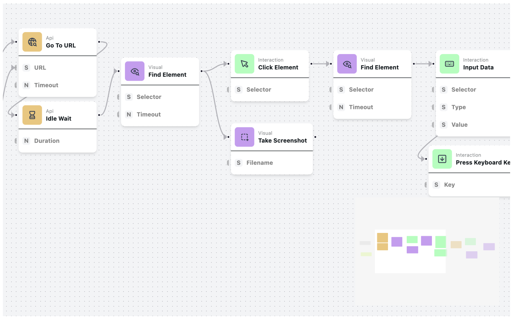

# Parrot-flow

A powerful visual workflow editor that enables seamless browser automation through a distributed server architecture, multiple browser agents, and an intuitive web interface for creating and managing automation workflows.

## Features

- **Visual Workflow Editor**: Drag-and-drop interface for building browser automation workflows .
- **Distributed Architecture**: Server-client model with multiple browser agents for scalable automation.
- **Cross-Browser Support**: Compatible with Chrome, Firefox, Edge, and other major browsers.

## Architecture

### System Components

| Component    | Description                                                  |
| ------------ | ------------------------------------------------------------ |
| **Backend**  | Central coordination server managing workflow distribution   |
| **Agents**   | Multiple browser instances for parallel automation execution |
| **Frontend** | Visual interface for workflow design and monitoring          |
| **Database** | Storage for workflows, execution history, and configuration  |

### Data Flow

1. Workflows are designed in the Visual Editor
2. Configuration is sent to the Main Server
3. Server distributes tasks to available Browser Agents
4. Agents execute automation and report back results

## License

This project is licensed under the GNU GPL-3.0 License - see the [LICENSE](LICENSE) file for details.

## 🙏 Acknowledgments

- **Playwright**: For browser automation foundation
- **React-Flow**: For drag-and-drop workflow editing foundation
- **Workflow Studio Concepts**: Inspired by visual workflow editors like `Automa`, `n8n`, `Apache Airflow` and many others
